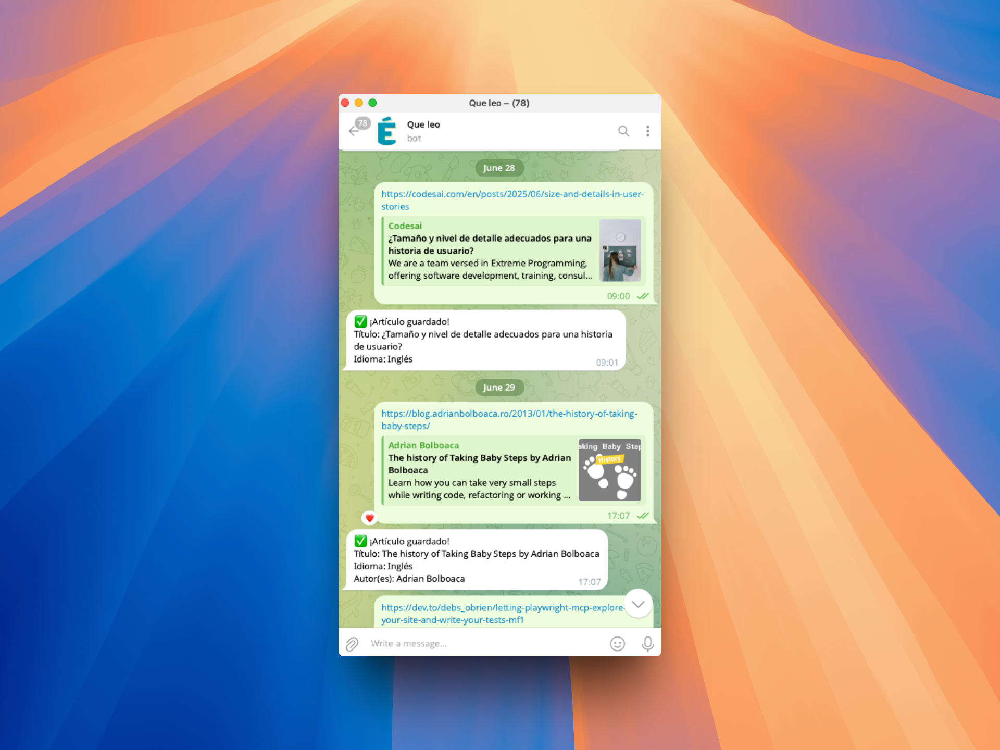

#  ¿Qué leo? Telegram bot

Un bot de Telegram que permite a los usuarios guardar artículos web en Supabase con extracción automática de metadatos.

## Características

- 🛡️ Rate limiting (5 artículos por minuto por usuario)
- ⚠️ Manejo robusto de errores con mensajes claros
- 🧪 6 tests automatizados
- ✅ Validación de URLs y metadatos
- 🔍 Extracción automática de metadatos de artículos

## Contribuir

Se aceptan Pull Requests. Por favor, asegúrate de que todos los tests pasen antes de enviar un PR.
