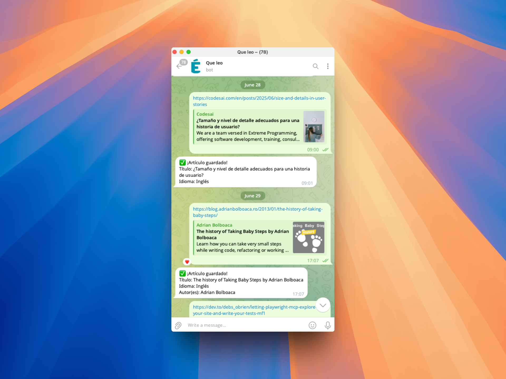

#  ¿Qué leo? Telegram bot

Un bot de Telegram que permite a los usuarios guardar artículos para leer después. En https://que-leo.vercel.app puedes ver un artículo aleatorio de tu lista y empezar a leer sin tener que decidir ni pensar demasiado.



## Características

- 🛡️ Rate limiting (5 artículos por minuto por usuario)
- ✅ Validación de URLs y metadatos
- 🔍 Extracción automática de metadatos de artículos
- 🌐 API HTTP para la app web (`/api/extract-metadata`)

## Inicio rápido

Crea un archivo `.env` en la raíz del proyecto:

```env
TELEGRAM_TOKEN=
SUPABASE_URL=
SUPABASE_ANON_KEY=
```

Opcionales: `PORT` (por defecto 3000), `ALLOWED_ORIGINS`, `LOG_LEVEL`.

```bash
npm install
npm start
```

El bot usa polling de Telegram, así que no necesitas abrir puertos si solo lo usas desde Telegram.

## Tests

```bash
npm test
```

